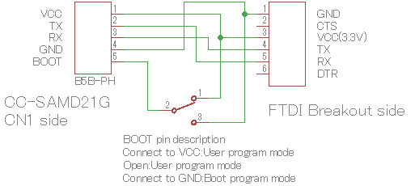
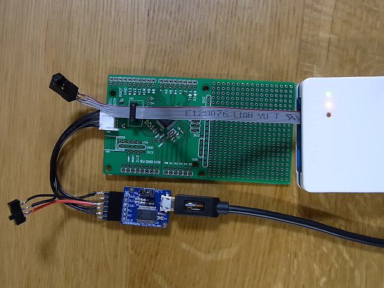
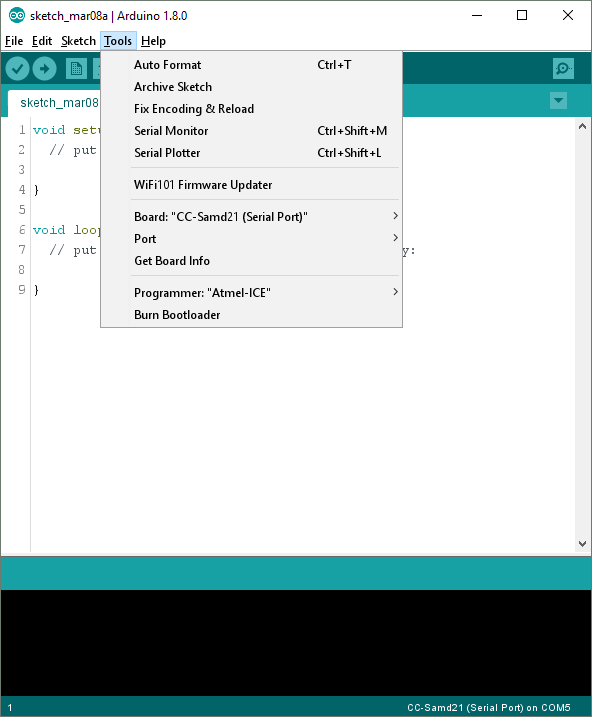

Burn Bootloader and upload a program for CC-samd21g Breakout Board
========================================

First of all
--------------
You will need the following items for this instruction.
 - ATEML-ICE
 - FTDI BREAKOUT BOARD(3.3V)
 - reprogramming cable(you should assebele it.)


Software Setup
--------------
To import the CC-samd21g Breakout Board, add the following text in the 'boards.txt' file, located in the following directory:

```
# CC-SAMD21G (Serial Port)
# ---------------------------------------
cc-samd21g.name=CC-SAMD21G (Serial Port)
cc-samd21g.upload.tool=bossac
cc-samd21g.upload.protocol=sam-ba
cc-samd21g.upload.maximum_size=262144
cc-samd21g.upload.use_1200bps_touch=false
cc-samd21g.upload.wait_for_upload_port=false
cc-samd21g.upload.native_usb=true
cc-samd21g.build.mcu=cortex-m0plus
cc-samd21g.build.f_cpu=48000000L
cc-samd21g.build.usb_product="CC-SAMD21G"
cc-samd21g.build.usb_manufacturer=""
cc-samd21g.build.board=SAMD_ZERO
cc-samd21g.build.core=arduino
cc-samd21g.build.extra_flags=-D__SAMD21G18A__ {build.usb_flags}
cc-samd21g.build.ldscript=linker_scripts/gcc/flash_with_bootloader.ld
cc-samd21g.build.openocdscript=openocd_scripts/arduino_zero.cfg
cc-samd21g.build.variant=arduino_zero
cc-samd21g.build.variant_system_lib=
cc-samd21g.build.vid=0x0000
cc-samd21g.build.pid=0x0000
cc-samd21g.bootloader.tool=openocd
cc-samd21g.bootloader.file=cc/samd21_sam_ba_cc.bin
```

```
* C:\Users\(username)\AppData\Local\Arduino15\packages\arduino\hardware\samd\1.6.xx
```

And store [custom bootloader](Software/bootloader) for this board shown as below.

```
    ^\1.6.xx\bootloaders\cc\samd21_sam_ba_cc.bin
```


Hardware Setup
--------------
Refer to the figure below to make reprogramming cable.  


### Connection
First you plug ATMEL-ICE SWD cable to CN1.  
ATMEL-ICE Power LED will turn on when you connect FTDI-BOARD with reprogramming cable to CN1.  
If Power LED were not turn on, you should check a cable or connectors certainly plugged.  



Burn Bootloader and Upload a program
--------------
### Burn Bootloader
After setting up borads.txt, you can find CC-samd21g board in the Tools > Board menu.  
  
Select CC-samd21g and Atmel-ICE as the Tools->Programmer. Then select Burn Bootloader.


### Upload a program
Before you upload your program, please check whether the switch(reprogramming cable) position is tied High(VCC).  
The board allow to control reset pin when EN pin is High.  
Click the Upload button in the IDE. Wait a few seconds. If successful, the message "Done uploading." will appear in the status bar.
